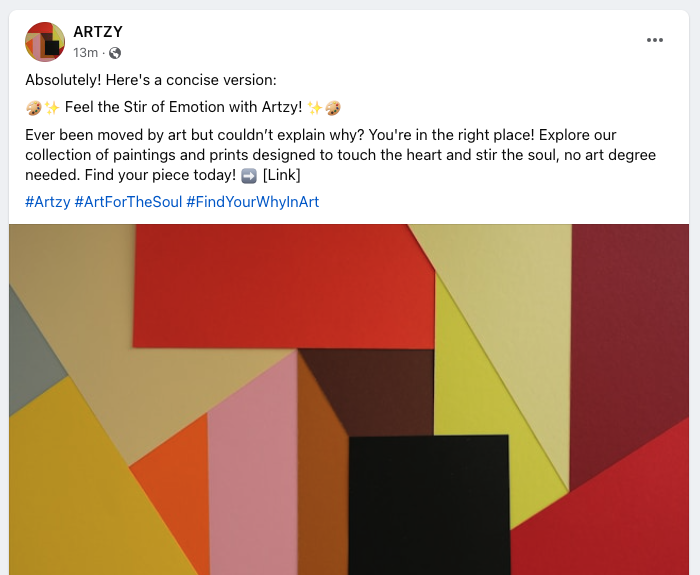
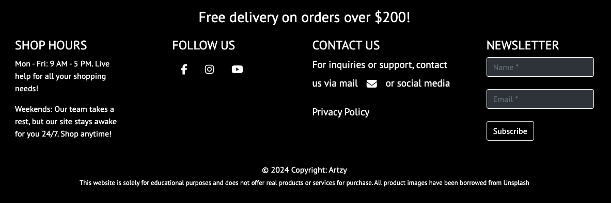

# Artzy

Artzy is a distinctive e-commerce platform developed as a part of Portfolio Project 5 for the Code Institute's Full Stack Software Developer Course. Utilizing Django, HTML, CSS, JavaScript, and Python, Artzy dismantles the barriers to art appreciation, offering an extensive array of paintings and prints accessible to everyone, irrespective of their art knowledge.

With a focus on emotional resonance rather than academic credentials, Artzy curates art that speaks directly to the heart. It is founded on the belief that art should be a source of joy and inspiration for all, fostering a connection between the viewer and the artwork without necessitating expertise.

The vision behind Artzy extends beyond merely selling art; it's about encouraging mindful engagement with art, supporting a lifestyle where beauty, creativity, and personal expression are paramount. This approach is in line with modern values of meaningful consumption and the growing desire for experiences that truly enrich lives.

In essence, Artzy is not just a platform; it's a movement toward making art accessible and enjoyable for everyone, promoting a deeper, more personal interaction with the world of art.

The site was deployed via Heroku - the live site can be found here -
[Artzy](https://artzy-f5e67145006a.herokuapp.com/)

# Table of Contents
- [Artzy](#artzy)
- [Table of Contents](#table-of-contents)
- [Project Rationale - Bridging the Art Appreciation Gap with Artzy](#project-rationale---bridging-the-art-appreciation-gap-with-artzy)
  - [Purpose and Goal: Simplifying Art Discovery and Ownership for Everyone](#purpose-and-goal-simplifying-art-discovery-and-ownership-for-everyone)
  - [Target Audience: Artzy's Commitment to Art Enthusiasts and Beyond](#target-audience-artzys-commitment-to-art-enthusiasts-and-beyond)
  - [Addressing Audience Needs: Tailoring the Artzy Experience](#addressing-audience-needs-tailoring-the-artzy-experience)
  - [Business Model and Customer Goals: Promoting Art Accessibility and Engagement](#business-model-and-customer-goals-promoting-art-accessibility-and-engagement)
  - [SEO Strategies: Enhancing Artzy's Digital Footprint](#seo-strategies-enhancing-artzys-digital-footprint)
    - [Note on SEO and Keyword Strategy](#note-on-seo-and-keyword-strategy)
  - [Sitemap.xml](#sitemapxml)
  - [Robots.txt](#robotstxt)
  - [Agile](#agile)
  - [Work approaach](#work-approaach)
  - [Marketing strategies](#marketing-strategies)
    - [Content Marketing](#content-marketing)
    - [SEO](#seo)
    - [Social Media Engagement](#social-media-engagement)
      - [Facebook](#facebook)
    - [Email Marketing](#email-marketing)
- [UI/UX Design](#uiux-design)
  - [Wireframes](#wireframes)
  - [Colors](#colors)
  - [Fonts](#fonts)
  - [Images](#images)
  - [Icons](#icons)
  - [Text content](#text-content)
  - [User stories](#user-stories)
  - [Features Overview](#features-overview)
    - [Navigation Bar](#navigation-bar)
    - [Home Page](#home-page)
    - [Account Registration Page](#account-registration-page)
    - [Login Page](#login-page)
    - [Logout Page](#logout-page)
    - [Product Listing Page](#product-listing-page)
    - [Product Detail Page](#product-detail-page)
    - [Wishlist Page](#wishlist-page)
    - [About Page](#about-page)
    - [Contact Page](#contact-page)
    - [User Experience Differentiation](#user-experience-differentiation)
    - [Newsletter Page](#newsletter-page)
    - [Shopping Cart Page](#shopping-cart-page)
    - [Checkout Page](#checkout-page)
    - [Checkout Success Page](#checkout-success-page)
    - [User Profile Page](#user-profile-page)
    - [Super User - Product \& Newletter Management](#super-user---product--newletter-management)
    - [Footer](#footer)
    - [Toast messages](#toast-messages)
  - [Security Features and Defensive Design](#security-features-and-defensive-design)
    - [User Authentication](#user-authentication)
    - [Form Validation](#form-validation)
    - [Database Security](#database-security)
    - [Error Page](#error-page)
  - [Database Design](#database-design)
    - [Entity Relationship Diagram](#entity-relationship-diagram)
    - [Custom Models](#custom-models)
      - [Wishlist \& WishlistItem Models](#wishlist--wishlistitem-models)
      - [Custom Newsletter and Subscriber Models](#custom-newsletter-and-subscriber-models)
      - [Other models](#other-models)
  - [Technologies](#technologies)
    - [Language](#language)
    - [Systems](#systems)
    - [Frameworks and Libraries](#frameworks-and-libraries)
    - [Programs and Services](#programs-and-services)
    - [Additional Tools](#additional-tools)
  - [Testing](#testing)
    - [Bugs](#bugs)
  - [Deployment](#deployment)
    - [Heroku](#heroku)
    - [Stripe](#stripe)
    - [AWS](#aws)
    - [Forking repository](#forking-repository)
    - [Cloning repository](#cloning-repository)
  - [References and Credits](#references-and-credits)
    - [References](#references)
    - [Credits](#credits)
    - [Disclaimer](#disclaimer)

# Project Rationale - Bridging the Art Appreciation Gap with Artzy
Artzy is a pioneering e-commerce platform designed to bridge the gap between the vibrant art community and those who may feel daunted by the world of art due to their limited knowledge. With a focus on simplifying art appreciation and making the acquisition of art pieces like paintings and prints more accessible, Artzy aims to connect a diverse audience to the art world. By utilizing strategic keywords such as "accessible art", "online art platform", and "art for beginners", we enhance our visibility and appeal to a wide range of art enthusiasts searching for easy entry points into art collection and appreciation.

## Purpose and Goal: Simplifying Art Discovery and Ownership for Everyone
Artzy’s mission is deeply rooted in demystifying the art discovery and purchase process. By offering a curated selection of "affordable paintings", "limited edition prints", and "digital art", we cater to a broad audience ranging from art novices to seasoned collectors. Keywords like "simplifying art discovery" and "online art buying" are integral to our content strategy, ensuring Artzy is easily found by those seeking to enrich their lives with art without the intimidation often associated with traditional art galleries.

## Target Audience: Artzy's Commitment to Art Enthusiasts and Beyond
Artzy is dedicated to serving a diverse group including "art enthusiasts", "gift shoppers", and "home decorators" looking for "unique art gifts" and "wall art" to personalize their spaces. Our platform targets individuals embarking on their "art discovery journey", leveraging keywords to resonate with users seeking "easy art buying experiences" and "art for personal spaces", ensuring a wide reach and relevance in search queries.

## Addressing Audience Needs: Tailoring the Artzy Experience
We understand the unique needs of our audience, from those making their first art purchase to seasoned collectors. Artzy's intuitive platform offers "emotion-based art", employing keywords that highlight our unique selling point like "user-friendly art selection" and "emotion-based art". This strategic use of language not only aids in SEO but ensures our platform meets the varied needs of our users, making art selection an informative and enjoyable process.

## Business Model and Customer Goals: Promoting Art Accessibility and Engagement
As a B2C e-commerce platform, Artzy champions "democratizing art access" and enhancing the art purchasing experience. Our diverse collection, ensuring there's something for every taste and preference. By integrating keywords related to "art e-commerce" and "digital art marketplace" into our digital marketing strategies, we aim to attract a broad audience and foster a culture of art appreciation, making art accessible to all.

## SEO Strategies: Enhancing Artzy's Digital Footprint
To maximize Artzy’s visibility online, we research and integrate specific keywords like "buy art online", and "start an art collection". Utilizing tools like Google Trends and Keyword Planner allows us to identify and incorporate terms that potential customers frequently use. Our content, from website metadata to newsletters, is carefully crafted to include these keywords, ensuring Artzy ranks highly in art-related searches. This strategic approach not only improves our search engine rankings but also makes art more accessible to those seeking it.

### Note on SEO and Keyword Strategy
In our mission to make art more accessible and to enhance Artzy's visibility online, we've employed a strategic approach to SEO (Search Engine Optimization). You'll notice terms within quotation marks, such as "buy art online" and "digital art marketplace," throughout this document. These aren't random; they're strategic keywords identified to enhance Artzy's search engine visibility. The quotation marks highlight these carefully chosen keywords, underscoring our targeted SEO efforts to connect with our audience more effectively. This transparent approach is part of our ongoing strategy to make Artzy easily discoverable and accessible to all art enthusiasts and newcomers alike.

## Sitemap.xml
Adding a sitemap.xml to Artzy aids search engines in quickly finding and indexing the pages, thereby improving the site's visibility and SEO, leading to increased traffic. The sitemap.xml acts as a roadmap of the website, listing all important pages and content. This facilitates easier discovery, indexing, and understanding of the site’s structure and content hierarchy by search engine crawlers, enhancing SEO by ensuring all art collections and related content are found and ranked appropriately, ultimately driving more organic traffic to Artzy.

## Robots.txt
Utilizing a robots.txt file for Artzy directs search engine bots on which pages to crawl and index, improving site navigation and SEO efficiency. The file serves as a directive for search engine bots, specifying which areas of the site should be crawled and which should be ignored. By managing bot traffic, I ensure the indexing of key pages and prevent server overload from unnecessary crawling. This not only improves Artzy’s SEO by ensuring relevant content is quickly found and indexed but also enhances the overall user experience by highlighting the most important content.

## Agile
The project followes agile methods. I identified epics and broke them down to user stories to map out what needs the customer and seller have. For every user story there are acceptance criteria that needs to be met and in some cases more concrete tasks. The userstories are sorted with the use of the MoSCoW method, giving the userstories labels like "Must Have", "Should Have", "Could Have" and "Wount have". Git Hub projects is used to document it and track the progress of the deveoplment. The epics and user stories are divided into to milestone. The first one is Requirements Specification and Analysis, Technical set up and Design and the second one is Interface and User experience including CRUD functionalities, search, sort and checkout processes.

The epics and user stories are documented on a Kanban board on Git Hub and can be viewed [here](https://github.com/users/aslinedvinsson/projects/8/views/1)

## Work approaach
This project originated from a template provided by a Code Institute project called Boutique Ado. After implementing all the features from Boutique Ado, I transitioned the project into a unique creation of my own. I modified aspects of the front end and introduced new features to the back end. For much of the design work, I utilized Bootstrap.

## Marketing strategies
To effectively market Artzy, the art e-commerce platform, I employ a multi-faceted strategy designed to engage our target audience and enhance online presence.

### Content Marketing
Newsletters and social media content are used to educate and inspire our audience about art. By focusing on storytelling, the aim is to highlight artists and their work, making art more relatable and accessible to everyone.

### SEO
I optimize the website with relevant keywords identified through research. This will improve the visibility in search engine results and attract organic traffic from individuals interested in purchasing art.

### Social Media Engagement
Artzy utilize platforms like Instagram and Facebook, where visual content thrives, to showcase the art pieces. Creating engaging posts and connecting with the audience through comments and stories is key.

#### Facebook

Facebook posts

### Email Marketing
Artzy launch an email newsletter to keep subscribers informed about new arrivals, exclusive offers, and upcoming sales. This strategy is intended to encourage repeat visits and foster a community around the brand.

# UI/UX Design
Artzy e-commerce platform is a vibrant gateway to creativity, featuring an inspiring homepage alive with color, designed to captivate and draw art lovers into a world of visual delight. With a minimalist approach, I’ve chosen a white background for browsing art, ensuring each piece stands out with its true colors and details, offering a clean and focused viewing experience akin to an exclusive gallery.

Navigation on my site is intentionally streamlined and intuitive, allowing you to explore curated collections effortlessly. The visual design emphasizes a user-friendly interface, highlighting simplicity and ease, making the discovery and acquisition of art an enjoyable and straightforward journey for every visitor.

## Wireframes

    
Desktop home page

    

    
Mobile home page

    

    
Desktop products page

    

    
Mobile products, products_detail and product_management page

    

    
Desktop product detail page

    

    
Desktop newsletter page

    

    
Mobile newsletter page 

    

    
Desktop shopping cart page

    

    
Desktop about page

    

    
Mobile about page with contact section

    

    
Desktop contact page

    

    
Desktop profile page

    

    
Desktop checkout page

    

    
Mobile shopping cart and checkout page

    

    
Desktop product management page

    

    
Desktop wishlist page

    

    
Desktop sign up for newsletter

    

    
Mobile newsletter and sign up for newsletter

    

## Colors
Choosing a vibrant and colorful image for the homepage with black text is a strategic move designed to instantly grab the visitor's attention. This pop of color makes a bold statement, ensuring the artwork and, by extension, the products, are the stars of the show.

The header integrates well with the colors of the index page, as well as with the white background on other pages and together with the black footer they enhance readability and frame the homepage art beautifully, without overshadowing the main attraction. On subsequent pages, the white background with black text continues this theme of simplicity and focus, ensuring that the colorful homepage art remains the visual highlight of the website.

This color scheme is not just about aesthetics; it's a deliberate choice to make the shopping experience more engaging and memorable. By keeping the design elements minimal and focused, the website directs visitors' attention exactly where it needs to be: on the products and the vibrant imagery that represents them.

 

## Fonts
PT Sans from [Google Fonts](https://fonts.google.com/?query=pt+sans) is a versatile, open-source font that's free and easy to use across all digital platforms. Its wide language support and variety of styles make it suitable for global projects and diverse design needs, ensuring the content is both accessible and visually appealing.

## Images
The site uses images from [Unsplash]( https://unsplash.com/).

## Icons
The site uses icons from [Font AIsome]( https://fontaIsome.com/ ).

Favicon comes from A by H Alberto Gongora from <a href="https://thenounproject.com/browse/icons/term/a/" target="_blank" title="A Icons">Noun Project</a> (CC BY 3.0)

## Text content
Text content, such as the names of artworks, artists, descriptions of the art, newsletter text is generated by ChatGPT.

## User stories

<b>Epic: About page</b>

<ul>
  <li><b>As a user, I want to read a concise overview of the art e-commerce site on the About page.</b>
    <ul>
      <li>The About page should contain a brief history of the company.</li>
      <li>The page should have contact information available.</li>
      <li>The About page should be easy to navigate.</li>
    </ul>
  </li>
</ul>

<b>Epic: Newsletter Subscription</b>

<ul>
  <li><b>As a website visitor, I want to fill out the newsletter subscription form, so that I can receive updates through a newsletter.</b>
    <ul>
      <li>The subscription form is easy to find on the website.</li>
      <li>The form requires minimal information (e.g., name and email address).</li>
      <li>Users receive a confirmation email upon subscription.</li>
    </ul>
  </li>
  <li><b>As a subscriber, I want to easily unsubscribe from the newsletter.</b>
    <ul>
      <li>Subscribers can unsubscribe via a link in the newsletter.</li>
      <li>Changes to subscription preferences are processed immediately.</li>
    </ul>
  </li>
  <li><b>As a seller, I want to create and send newsletters to subscribers.</b>
    <ul>
      <li>There is an interface for creating newsletter content.</li>
      <li>Newsletters can be sent to all subscribers.</li>
    </ul>
  </li>
</ul>

<b>Epic: Message Notification to Users</b>

<ul>
  <li><b>As a user, I receive notifications for important updates or messages.</b>
    <ul>
      <li>User receives notifications for account-related activities like registration, login/logout, and password changes.</li>
      <li>User receives notifications for shopping cart-related activities like changes the user does in the shopping cart before submitting the order.</li>
      <li>User receives notifications for order-related activities like order confirmation, delivery.</li>
    </ul>
  </li>
</ul>

<b>Epic: Wishlist</b>

<ul>
  <li><b>As a customer, I want to add products to my wishlist so that I can return to them later.</b>
    <ul>
      <li>The customer can add a product to the wishlist from the product page.</li>
      <li>The customer can see the number of products in their wishlist on the main menu.</li>
      <li>The customer can view their wishlist by clicking on the wishlist in the main menu.</li>
    </ul>
  </li>
  <li><b>As a customer, I want to see my saved products in my wishlist so that I can plan my purchases.</b>
    <ul>
      <li>The wishlist shows all products that the customer has added.</li>
      <li>The customer can see product images, names, prices for each product in the wishlist.</li>
    </ul>
  </li>
  <li><b>As a customer, I want to remove products from my wishlist so that I can manage my desires.</b>
    <ul>
      <li>The customer can remove a product from the wishlist from the wishlist page.</li>
      <li>When a product is removed from the wishlist, the wishlist is immediately updated.</li>
    </ul>
  </li>
</ul>

<b>Epic: Checkout management</b>

<ul>
  <li><b>As a user, I can proceed to checkout and complete the purchase.</b>
    <ul>
      <li>User can navigate to the checkout page from the shopping cart.</li>
      <li>User can view the summary of items in the cart.</li>
      <li>User can input delivery and payment details.</li>
      <li>User receives confirmation upon successful payment completion.</li>
    </ul>
  </li>
</ul>

<b>Epic: Shopping cart management</b>

<ul>
  <li><b>As a user, I can add items to my shopping cart for purchase.</b>
    <ul>
      <li>User can click on the "Add to Cart" button on the item details page.</li>
      <li>Item is added to the user's shopping cart.</

li>
      <li>User can view the updated cart with the added item.</li>
      <li>User can add multiple items to the cart.</li>
    </ul>
  </li>
  <li><b>As a user, I can update items in my shopping cart to change their quantities or remove them altogether before finalizing my purchase.</b>
    <ul>
      <li>Next to each item in the cart, there are options to adjust the quantity of the item or remove it from the cart.</li>
      <li>When the user adjusts the quantity, the cart updates to reflect the new quantity of the item.</li>
      <li>User can remove multiple items from the cart in one session.</li>
    </ul>
  </li>
</ul>

<b>Epic: System setup</b>

<ul>
  <li><b>User story: As a developer, I set up a new Django project to develop a web application.</b>
    <ul>
      <li>Start Django project.</li>
      <li>Create .gitignore file.</li>
      <li>Add allowed hosts in settings.py.</li>
      <li>Create superuser account.</li>
      <li>Install Django allauth.</li>
    </ul>
  </li>
</ul>

<b>Epic: Product Management</b>

<ul>
  <li><b>As a user, I can view the list of items and details of an item listed on the e-commerce site.</b>
    <ul>
      <li>User can view a list of items and select some to purchase.</li>
      <li>User can view a specific category of items without having to search through all items.</li>
      <li>User can navigate to the item details page.</li>
      <li>User can view item name, description, price, and images.</li>
      <li>User can see seller information.</li>
      <li>User can see reviews and ratings if available.</li>
    </ul>
  </li>
</ul>

Git Hub Kanban board and all user stories can be viewed [here](https://github.com/users/aslinedvinsson/projects/8/views/1)

## Features Overview

### Navigation Bar

The navigation bar is designed to be intuitive and user-friendly, offering a seamless browsing experience regardless of the user's registration status.
Unregistered User: For visitors who still need to sign up, the navigation bar features easy access to the site's offerings. It includes a brand logo that serves as a home button, a search bar for finding artwork, a link to the login/signup page for easy account creation, and a shopping cart icon that previews items selected for purchase.
Registered User: For logged-in users, the navigation bar becomes more personalized. It still includes the brand logo, search functionality, and a shopping cart icon reflecting the user's selected items. Additionally, it provides a dropdown menu for easy access to the profile page and wishlist, enhancing the user's shopping experience.

### Home Page

The home page of Artzy displays a large image that inspires a desire to see more art, accompanied by a message: "Knowing Nothing About Art Yet Having That Burning Desire to Stare at Something, with Feelings Unnamed," along with a "Shop Art" button.

### Account Registration Page

The registration page is straightforward and welcoming to new users. It features a simple registration form asking for basic information to create an account. Below the form, there's a direct link for users who already have an account to log in, making the transition between registering and logging in seamless.

### Login Page

The login page is clean and user-centric, featuring a form for email or username and password input, a "Remember Me" checkbox for convenience, and a password recovery link for those who need it. Links back to the home page are provided for users who decide against logging in at the moment.

### Logout Page

On the logout page, users find a simple and clear interface with a logout button. This page confirms the user's intention to log out and provides a smooth exit route from their profile.

### Product Listing Page

Artzy’s product listing page is a gallery of available artworks, showcasing images, artists, categories, ratings, and prices. It’s designed for easy navigation, including filters for categories, artists, print or painting and price ranges. A "Back to Top" button improves user navigation.

### Product Detail Page

The product detail page offers images of the artwork, detailed information about the artist, category, rating, print paper, price, and a thorough description. Users can select the quantity they wish to purchase and have the option to keep shopping or add the product to their bag. An "Add to Wishlist" button is available for registered users, encouraging engagement and return visits.

### Wishlist Page

Designing models to efficiently represent wishlists and wishlist items, along with writing queries to manage the relationships between users, wishlists, products, and wishlist items, proved complex. I focused on ensuring efficient data retrieval and updates, a task that became increasingly crucial as the dataset grew. I had scenarios where a user attempted to add a product already present in their wishlist. To address this, I implemented logic to prevent duplicate entries and to provide appropriate feedback to the user. Additionally, adding items from the wishlist to the shopping cart required coordination among different parts of the application. I ensured that items were added correctly and quantities were managed appropriately, all while providing feedback to the user. Moreover, I worked on implementing dynamic updates to the wishlist without full page reloads to enhance the user experience, making it more responsive.

### About Page

The About Page is a space that tells the story of Artzy. It features an image that embodies the essence of the platform, accompanied by text that narrates the mission and vision of Artzy.

### Contact Page

Designed for ease of communication, the Contact Page includes a straightforward user contact form. This form allows visitors and users to quickly send inquiries or feedback directly to the Artzy team, ensuring that voices are heard and any concerns are addressed promptly.

### User Experience Differentiation
Artzy offers a tailored browsing experience depending on the user's login status. Logged-out users see a general overview of the platform's features and art products. They can still purchase art and subscribe to the newsletter without creating an account. Logged-in users have access to a profile page, where they can view their order history and access their wishlist, allowing them to save products for future purchases.

### Newsletter Page

The newsletter page displays an image and the latest newsletter, which is also distributed to subscribers.

I integrated multiple complex newsletter functionality, covering subscription, newsletter management, and email distribution. Managing the flow and ensuring all parts worked together seamlessly was a bit challenging. When creating dynamic unsubscribe links unique to each subscriber, as demonstrated in the send_confirmation_email function, it was necessary to carefully construct URLs and encode subscriber IDs. This process ensured that the unsubscribe functionality worked correctly and securely for each user. To enable superusers to select which newsletter appears on the page, I utilized session variables to remember their choices.

### Shopping Cart Page

The Shopping Cart Page is a detailed overview of a user's intended purchases. It lists each item's price, quantity, and subtotal, alongside options to manage the cart items. The page also summarizes the total cost, delivery charges, and highlights the free delivery threshold. Navigation buttons offer a smooth transition to continue shopping or proceed to checkout.

### Checkout Page

The Checkout Page provides users with a final review of their order, including a summary of the items, delivery information, and available payment options. It outlines the steps needed to complete the purchase, ensuring a transparent and user-friendly checkout process.

### Checkout Success Page
After a successful purchase, the Checkout Success Page confirms the order and informs the user that a confirmation email has been sent. This page serves as reassurance of the successful transaction, providing details on next steps and delivery expectations.

### User Profile Page

Displays the user's delivery details and order history, with links to detailed order confirmation, profile management and wishlist.

### Super User - Product & Newletter Management

Exclusively accessible to super users, this section provides tools for adding, updating, and deleting products from the Artzy catalog. The superuser can also create and send newsletters, as well as change the displayed newsletter, directly from the site without accessing the Django admin panel.

### Footer

Present on every page, the footer is a constant element that enhances the user's navigation experience. It prominently features a free delivery banner, along with information such as shop hours, contact us, follow us on social media, privacy policy, and a newsletter sign-up form, which is also available on the newsletter site.

### Toast messages

Toast messages provide users with feedback on their actions within the web application. Using Django, these lightweight, dismissible notifications inform users about the result of their actions without redirecting them away from their current page.

## Security Features and Defensive Design

### User Authentication
User authentication is applied to protect user data and prevent unauthorized access. During registration, users create a unique username and a strong password, following stringent security requirements. The login process securely verifies these credentials.

### Form Validation
Should a form be submitted with incorrect or missing information, it will not proceed, and the user will receive a notification identifying the field that triggered the error.

### Database Security
The env.py file securely stores the database URL and secret key to safeguard against unauthorized database access, a setup established prior to the initial push to GitHub.

To enhance site security, Cross-Site Request Forgery (CSRF) tokens have been implemented across all forms.

### Error Page
404 - Page Not Found error page was created to guide them back to the site.

## Database Design
### Entity Relationship Diagram
 

### Custom Models
#### Wishlist & WishlistItem Models

In this Django application, I have developed custom models designed to manage user wishlists and the items within them. These models are integral to a system that includes user profiles and product catalogs, aiming to provide a seamless e-commerce or retail experience.

**Wishlist Model**

The Wishlist model functions within the application's relational database, designed to store product IDs that users intend to purchase later. It is directly linked to the User Profile model through a foreign key, establishing a one-to-many relationship. Currently, this relationship allows each user to maintain a single wishlist. Future enhancements are planned to expand this functionality, enabling users to create and manage multiple wishlists.

User association is achieved by incorporating a foreign key in the Wishlist model that references the User Profiel models's primary key. This setup ensures that each wishlist is unequivocally associated with a single user account.

The model includes a varchar field named 'name', permitting users to assign a unique, descriptive title to each wishlist. This feature is in a later stage of development crucial for users who wish to organize their desired items under various categories or themes for easier future access.

**WishlistItem Model**

The WishlistItem model represents individual items saved within a wishlist. This model allows users to add products from the product catalog to their wishlists.

Wishlist Association: Each item belongs to a specific wishlist, which aids in the organized management of wishlist items.
Product Reference: Items within a wishlist are directly linked to products from the product catalog, making it easy for users to access product details and purchase options.

#### Custom Newsletter and Subscriber Models
The Newsletter and subscriber models together facilitate a straightforward yet effective system for managing newsletter subscriptions and distributing content to a list of subscribers.

**Newsletter model**

The custom Newsletter model is designed to create and manage newsletters within the application. Each newsletter includes a title, content, and an optional image. The created_on field automatically records the time when a newsletter is created. This model is essential for distributing information, updates, or promotional content to subscribers.

**Subscriber Model**

The custom Subscriber model keeps track of individuals who subscribe to receive newsletters. It includes the subscriber's email, name, and a unique identifier. The email field is unique for each subscriber, ensuring that each email address is only registered once.

#### Other models
The code used for the following models are taken from CodeInstitute Walkthroughs "I think, therefore I blog" and "Boutique Ado Walktrhough" and are slightly modified.

**Product Model**

 The model is altered and now includes artist and is_print attributes, providing a distinction between original artworks and prints. This adjustment allows users to filter products based on whether they are original paintings or prints. Furthermore, for prints, users can select the type of print paper from options such as Japanese Washi, Cotton Rag, Bristol Paper, and Photo Paper, enhancing customization and user choice.

**About Model**

The About model is crafted for the "About Us" section, providing a space to share details like the section's title, content, and an associated image. The updated_on field captures the last update timestamp, ensuring the section remains current. A default image can be used if none is specified.

**ContactRequest Model**

The ContactRequest model manages incoming messages through a contact form, recording the sender's name, email, and message. A boolean field, read, indicates whether the message has been reviewed.

Additionally, there are minor alterations to some of the other models.

## Technologies

### Language
* HTML5 - Provides the content and structure for the website.
* CSS - Provides the styling for the website.
* Python - Provides the functionality for the site.
* Django - Used as the Python framework for the website.
* Javascript - Used to add card payment, country field, sorting products, back to top click function, update the item quantity, and remove the item from the shopping cart

### Systems
- **Git**: A version control system for tracking changes in computer files and coordinating work on those files among multiple people. [Git](https://git-scm.com/)

- **AWS S3 and IAM**: Amazon Ib Services (AWS) provides cloud computing services. S3 (Simple Storage Service) is for storage, and IAM (Identity and Access Management) is for managing access to AWS services securely. [AWS S3 and IAM](https://aws.amazon.com/)

### Frameworks and Libraries
- **Django**: A high-level Python framework that enctheages rapid development and clean, pragmatic design. [Django](https://www.djangoproject.com/)
- **Bootstrap**: A front-end framework for developing responsive and mobile-first websites. [Bootstrap](https://getbootstrap.com/)
- **Psycopg2**: A PostgreSQL adapter for Python. [Psycopg2](https://pypi.org/project/psycopg2/)
- **Gunicorn**: A Python WSGI HTTP Server for UNIX, used to run Python Ib applications. [Gunicorn](https://gunicorn.org/)

### Programs and Services
- **GitHub**: An online platform for hosting and sharing code repositories. [GitHub](https://github.com/)
- **GitPod**: A cloud-based Integrated Development Environment (IDE) that provides a complete dev environment for GitHub projects. [GitPod](https://www.gitpod.io/)
- **ElephantSQL**: A cloud-based PostgreSQL database service. [ElephantSQL](https://customer.elephantsql.com/login)
- **Prycopg2**:Used as a postgres database adapter. [Psycopg2](https://pypi.org/project/psycopg2/)
- **Gunnicorn**: Used as a website server provider. [Gunicorn](https://gunicorn.org/)
- **Heroku**: A cloud platform service that enables developers to build, run, and operate applications entirely in the cloud. [Heroku](https://id.heroku.com/)
- **Stripe**: A payment processing platform for handling secure payments. [Stripe](https://stripe.com/ie)
- **XML-Sitemaps**: A tool for generating website sitemaps. [XML-Sitemaps](https://www.xml-sitemaps.com/)
- **Privacy Policy Generator**: An online tool to generate privacy policies for websites. [Privacy Policy Generator](https://www.privacypolicygenerator.info/)

### Additional Tools
- **Balsamiq**: A wireframing tool for designing user interfaces. [Balsamiq](https://balsamiq.com/)
- **LucidChart**:diagramming tool used for creating ERDs (Entity-Relationship Diagrams). [Lucidchart](https://lucidchart.com)
- **AmIresponsive**: A tool to check how responsive a website is on different devices. [AmIresponsive](https://ui.dev/amiresponsive)
- **Favicon**: A tool for creating favicons (the small icons that appear in the tab of a Ib browser). [Favicon](https://favicon.io/)
- **Google Chrome DevTools**: A set of Ib developer tools built directly into the Google Chrome browser. [Google Chrome DevTools](https://developer.chrome.com/docs/devtools/)
- **HTML Validation Service**: A tool to check the markup validity of Ib documents in HTML. [HTML Validation](https://validator.w3.org/)
- **CSS Validation Service**: A service to check the validity of Cascading Style Sheets (CSS). [CSS Validation](https://jigsaw.w3.org/css-validator/)
- **CI Python Linter**: A Code Insitute tool to validate Python. [CI Python Linter](https://pep8ci.herokuapp.com/)
- **JSHint**: A tool to validate JavaScript. [JSHint](https://jshint.com)

- **Lighthouse**: Google Lighthouse is a web performance and SEO auditing tool that analyzes web pages, providing detailed reports and recommendations for improving page speed, accessibility, and user experience. [Lighthouse](https://developer.chrome.com/docs/lighthouse/overview/)

## Testing
Full testing can be seen in [TESTING.md](TESTING.md) file.

### Bugs
All identified bugs were resolved.

## Deployment

### Heroku
- Create an account or log in to **Heroku**.
  - On the dashboard, click on **"New"** and select **"Create new app"**.
  - Give the app a unique name and select the region closest to you. Then click **"Create app"** to confirm.
- To create a new database accessible by Heroku, create an account or log in to **ElephantSQL**.
  - Click **"Create New Instance"**.
  - Set up ythe plan by giving it a name and choosing the **"Tiny Turtle (free)"** plan.
  - Select the Region and data center closer to you, then click **"Review"** and confirm by clicking on **"Create instance"**.
  - Return to the ElephantSQL dashboard and click on the database instance name for this project.
  - In the URL section, click the copy icon to copy the database URL.
- Install the plugins `dj-database-url` and `psycopg2-binary` in the terminal.
  - Run `pip3 freeze > requirements.txt` so both are added to the `requirements.txt` file.
- Create a **Procfile** in the root directory, adding `Ib: gunicorn ytheapp.wsgi:application`.
- Run the migration command in ythe terminal to migrate ythe database structure to the newly-connected ElephantSQL database: `python manage.py migrate`.
- Run `python3 manage.py createsuperuser` to create a superuser.
- Load the `.json` files for categories and products.
- Install `gunicorn` (`pip install gunicorn`) and add it to the `requirements.txt` file using the command `pip3 freeze > requirements.txt`.
- In `ALLOID_HOSTS`, add the Heroku app and localhost to the list: `ALLOID_HOSTS = ['HEROKU_APP_NAME.herokuapp.com', 'localhost']`.
- Add a config variable by typing `DISABLE_COLLECTSTATIC = 1`.
- Connect Heroku to the GitHub repository and enable automatic deploys.
- Deploy the app and access the website.

### Stripe
- Sign up for a Stripe account.
- Navigate to the **Developers** tab, then to the **API** area and retrieve ythe publishable and secret keys.
- Incorporate `STRIPE_PUBLIC_KEY` and `STRIPE_SECRET_KEY` into `settings.py` and into ythe Heroku configuration, using the information from the API section.
- Proceed to the **webhooks** area to establish a new webhook.
- Select the option to display all events and specify ythe endpoint.
- Incorporate `STRIPE_WH_SECRET` into both ythe environment variables and Heroku setup.

### AWS
- Sign up for an account on the **AWS Management Console**.
- Navigate to **S3** and initiate a new bucket creation.
- Configure the bucket settings, including static hosting, CORS configuration, and bucket policy for access and permissions.
- Proceed to **IAM** to establish a new group.
- Develop a Policy tailored for this group's permissions.
- Generate a User and associate it with the group and policy created earlier.
- Upon creating the User, download the CSV file from the User's profile, which includes the user's access key ID and secret access key.
- Implement `boto3` and `django-storages` in ythe project, then update the `requirements.txt` file with these dependencies.
- Integrate AWS service variables into `settings.py` to link ythe application's static storage with AWS.
- Create a dedicated media folder within ythe project structure to organize all media files for storage on AWS.

### Forking repository
- Forking enables you to create a personal copy of an existing repository on a remote server. To do so with the specified repository:

- Navigate to the **[repository](https://github.com/aslinedvinsson/Artzy.git)**  on GitHub.
- Click on the **"Fork"** button located at the top right corner of the page.
- This action will generate a copy of the repository under ythe own GitHub account.

### Cloning repository
- Cloning creates a local version of a repository, maintaining a connection to the original sthece. To contribute modifications to a repository you have access to, begin with cloning before applying changes and pushing them:

- Navigate to the **[repository](https://github.com/aslinedvinsson/Artzy.git)** on GitHub.
- Click on the **"Code"** dropdown menu and choose ythe cloning method: **HTTPS**, **SSH**, or **GitHub CLI**, then copy the URL provided.
- Open a **Terminal** window.
- Change to the directory where you wish the cloned repository to be located.
- Type `git clone`, folloId by the URL you copied in the previous step.
- Hit enter to execute the cloning command, creating a local copy of the repository.

## References and Credits
### References
The Code Institute's repository boilerplate for Gitpod was utilized, along with code from the two walkthroughs: Boutique Ado and I Think Therefore I Blog.

Footer is inspired by https://mdbootstrap.com/docs/standard/navigation/footer/

### Credits
A heartfelt thank you to all the Code Institute tutors for their invaluable guidance and support throughout this journey.

My deepest appreciation goes to my mentor Jad Mokdad, whose support, wisdom, and endless patience have been the cornerstone of my learning journey. His expert guidance navigated me through the intricate challenges of this project, encouraging me to expand my horizons and aim for a higher standard. The successful completion of this project and my growth into a full-stack developer are direct results of his mentorship. I am immensely grateful for his significant role in shaping my path in the tech world. Thank you for being an integral part of my journey towards becoming a full-stack developer.

### Disclaimer
The content available on this site is solely for educational purposes and should not be interpreted as professional advice.
