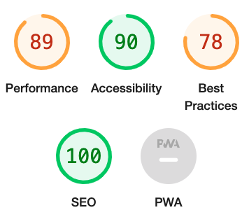

Back to the [README](README.md)

Testing was an ongoing process during the project's development, with each view undergoing frequent evaluation. Whenever results deviated from expectations, immediate debugging efforts were undertaken.

### Python Validation - PEP8
Python testing was done using the [Code Institute's PEP8](https://pep8ci.herokuapp.com/) to ensure there were no syntax errors in the project. All python files were entered into the online checker and no errors were found in any of the custom codes.

### Google Lighthouse
Home page Google Lighthouse result on desktop:

[More Google Lighthouse results can be viewed here](docs/lighthouse/)

### HTML Validation
[W3C](https://validator.w3.org/) were used to validate html. The HTML code I have written passed the W3C markup validation. The errors that occurred with my own code have been resolved.

**Issues with Forms**
While validating the forms, I encountered some issues stemming from Django Crispy Form and the Summernote library that activates upon using these forms. Since these errors originated from Django Crispy Form and Summernote rather than my own code, I was unable to resolve them, leaving the issues unaddressed.

### CSS Validation
No errors were found when using [W3C Jigsaw validation](https://jigsaw.w3.org/css-validator/) for the custom CSS.

### JavaScript Validation
No errors were found when using [JS Hint](https://jshint.com/) for the Javascript, when adding /* jshint esversion: 6 */ /* globals bootstrap */ in top of the code in JS Hint.

### Console Results
The browser console shows no errors.

### Browser Testing
The Website was tested on Google Chrome, Firefox, Safari browsers with no issues noted.

### Manual Testing
[User Acceptance Testing and Functional Testing](manual_testing.md)

### Remaining Bugs
No identified remaining bugs.
